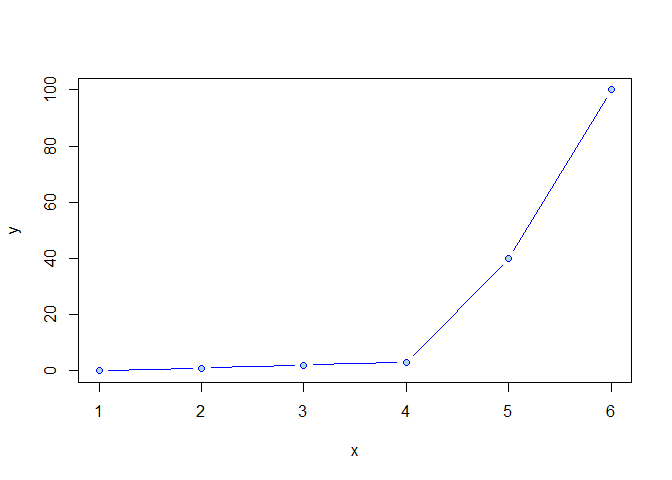
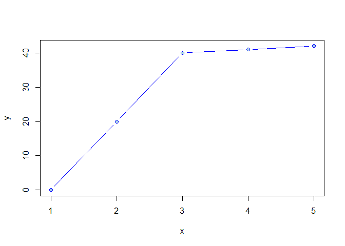
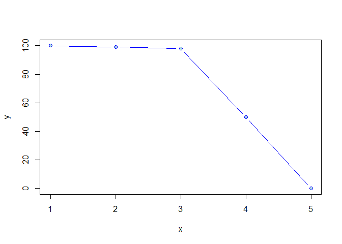
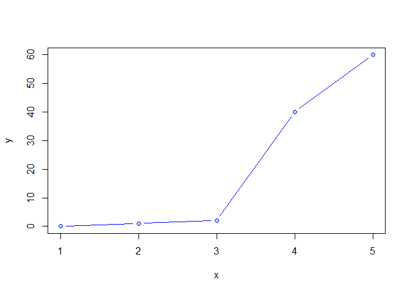

<!-- README.md is generated from README.Rmd. Please edit that file -->
<!-- badges: start -->

<a href="https://cran.r-project.org/package=pkgdown" class="pkgdown-release"></a>
<a href="https://github.com/r-lib/pkgdown/actions" class="pkgdown-devel"></a>
[](https://app.codecov.io/gh/r-lib/pkgdown?branch=main)
<!-- badges: end -->

# kneedle

<!-- badges: start -->
<!-- badges: end -->

The goal of kneedle is to provide an easy to use implementation of the
kneedle algorithm developed at
<https://raghavan.usc.edu/papers/kneedle-simplex11.pdf>. Rather than
following an object oriented implementation (KneeLocator in Python and
Kneer) of the algorithm, this takes a more functional approach which is
easier to understand for beginners. The main functionality is to detect
an inflection point, more commonly associated in continuous function, in
discrete datasets which closely follow an exponential decay/growth,
logarithmic decay/growth.

Please report bugs to Emmet Tam, at <emmet_tam@yahoo.com> or through
github.

## Installation

You can install the development version from
[GitHub](https://github.com/) with:

``` r
install.packages("devtools")
devtools::install_github("etam4260/kneedle")
```

## Example

This is a basic example:

``` r
library(kneedle)
#> Registered S3 method overwritten by 'quantmod':
#>   method            from
#>   as.zoo.data.frame zoo

# The base function 'guesses' whether the data is increasing or decreasing.
# (Will assume if the derivative of the first and last point is positive or negative:
# positive is increasing and negative decreasing)
# It also guesses the 'concavity' of the data. (Will use second derivative calculations)
# If no sensitivity value provided, it will default to a sensitivity of 1. 

# First and second inputs must be vectors of integers or doubles.

knee <- kneedle(c(1,2,3,4,5,6), c(0,1,2,3,40,100))
print(knee)
#> [1] 4 3
plot(c(1,2,3,4,5,6), c(0,1,2,3,40,100), xlab = "x", ylab = "y", pch=21, col="blue", bg="lightblue", type = "b")
```



## Parameters

This describes a few of the parameters that can be changed.

``` r
library(kneedle)
# Concavity parameter can be changed if the graph is convex. Furthermore, you 
# specify if the y is increasing or decreasing as x increases. However, the
# algorithm has 'autodetection' for those values.

knee <- kneedle(c(1,2,3,4,5), c(0,20,40,41,42), concave = FALSE, decreasing = FALSE)
print(knee)
#> [1]  3 40
plot(c(1,2,3,4,5), c(0,20,40,41,42), xlab = "x", ylab = "y", pch=21, col="blue", bg="lightblue", type = "b")
```



``` r

knee <- kneedle(c(1,2,3,4,5), c(100,99,98,50,0), concave = FALSE, decreasing = TRUE)
print(knee)
#> [1]  3 98
plot(c(1,2,3,4,5), c(100,99,98,50,0), xlab = "x", ylab = "y", pch=21, col="blue", bg="lightblue", type = "b")
```



## Sensitivity

This describes how the sensitivity parameter affects the output.

``` r
library(kneedle)
# Sensitivity defaults to 1 as per the referenced paper. However, you can adjust 
# it. A higher sensitivity make the rules more 'stringent' in classifying a 
# 'candidate knee' point as a knee. 

knee <- kneedle(c(1,2,3,4,5), c(0,1,2,40,60), sensitivity = 1)
print(knee)
#> [1] 3 2
plot(c(1,2,3,4,5), c(0,1,2,40,60), xlab = "x", ylab = "y", pch=21, col="blue", bg="lightblue", type = "b")

# In this case with sensitivity = 2, we see that that (3,2) is no longer considered a knee point. No
# other knees were detected.

knee <- kneedle(c(1,2,3,4,5), c(0,1,2,40,60), sensitivity = 2)
print(knee)
#> numeric(0)
plot(c(1,2,3,4,5), c(0,1,2,40,60), xlab = "x", ylab = "y", pch=21, col="blue", bg="lightblue", type = "b")
```


